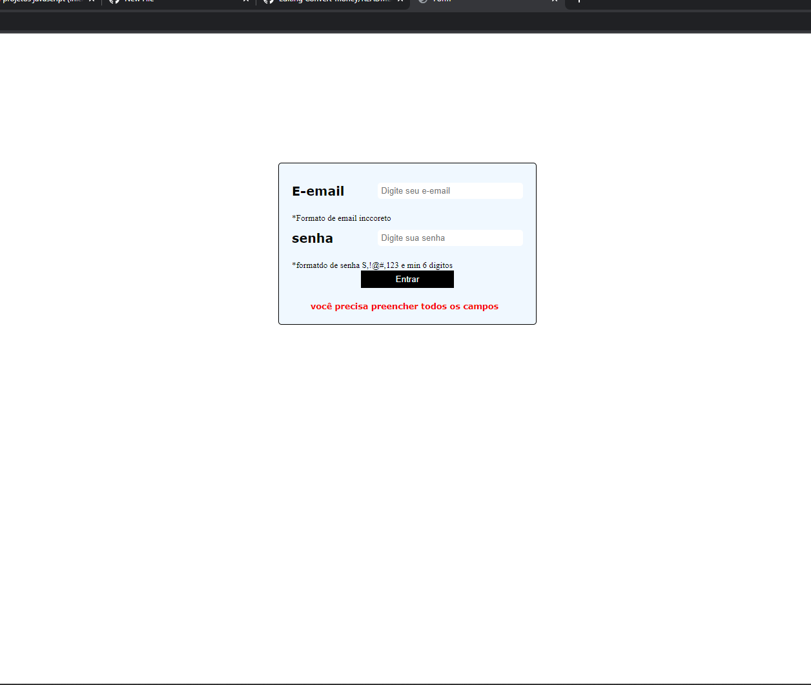

# estudosjs-partWeb
Estudos

# Criançao de login de autenticação  basico para praticar  JavaScript

> Concluido estudo no foco de criar autenticação de email e senha. a autenticação pede para que o Email seja composto com @ e .com,e senha com Letra maiuscula minino 6 digitos e caracteres espeicais, foi utilizado o regex.

- [x] Criação do HTML
- [x] Criação do CSS
- [x] JavaScript
